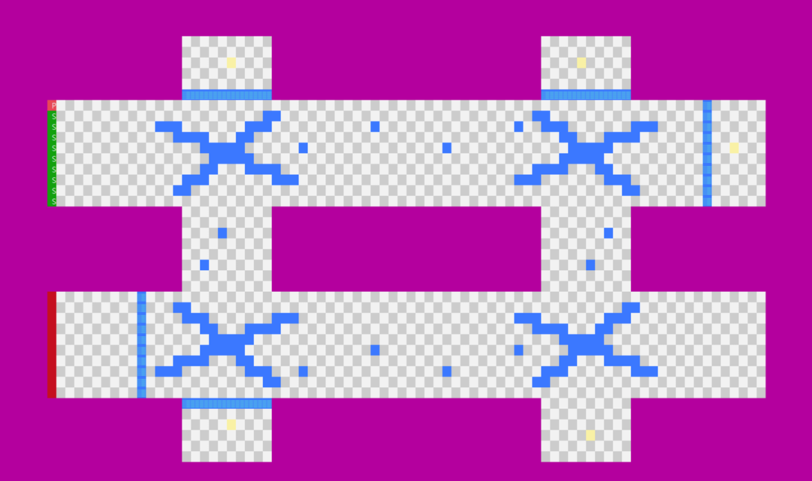
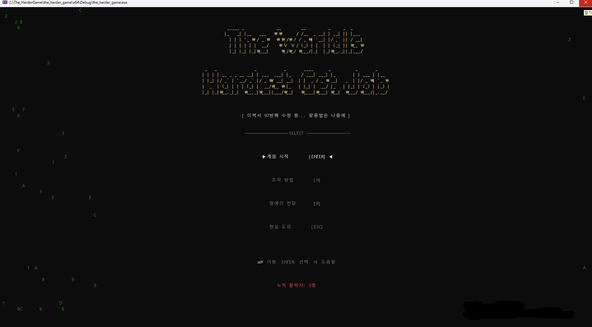
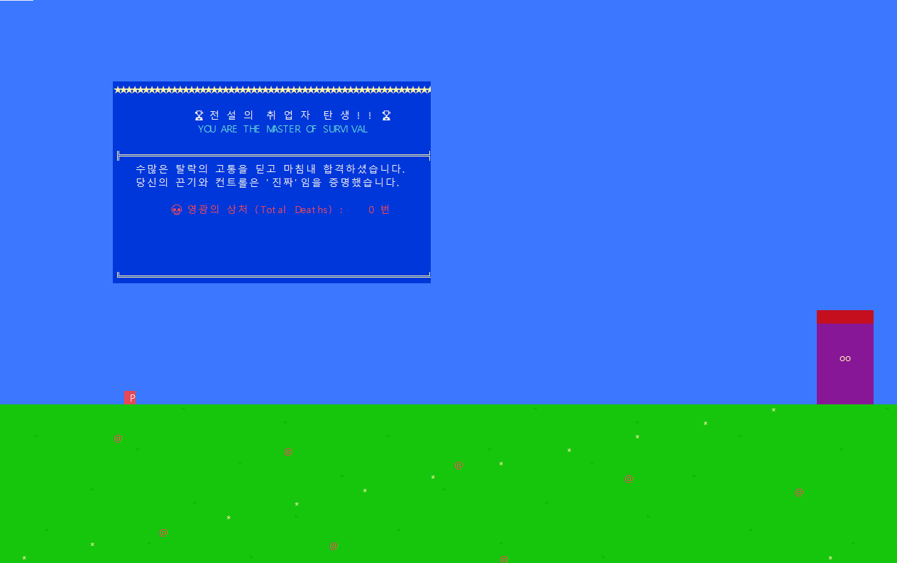
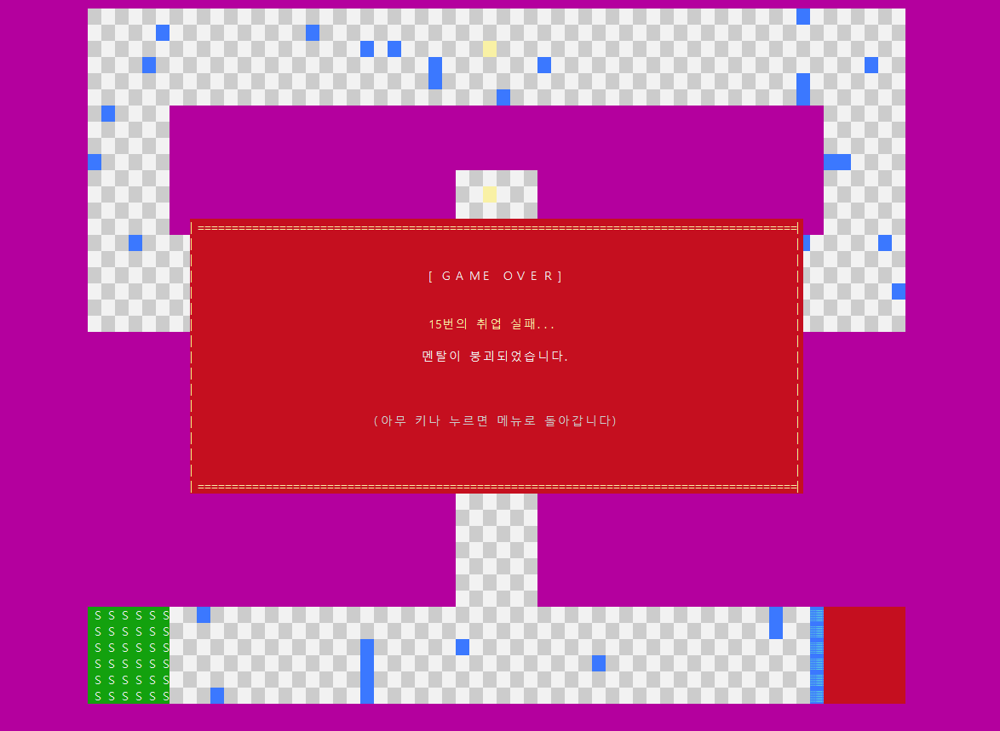
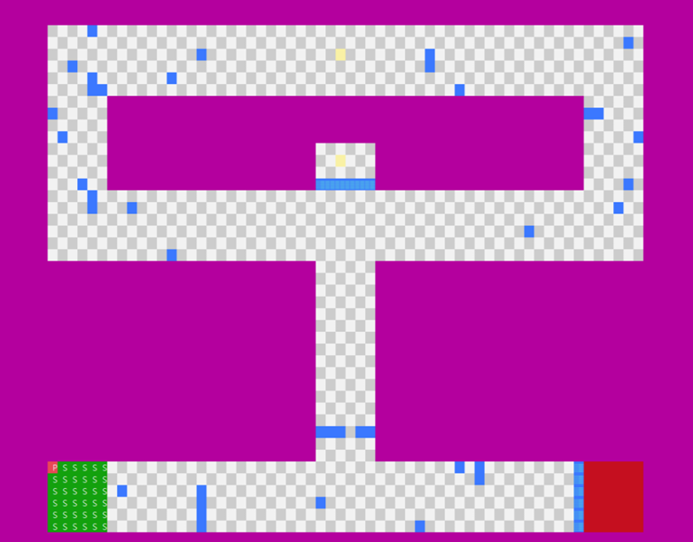
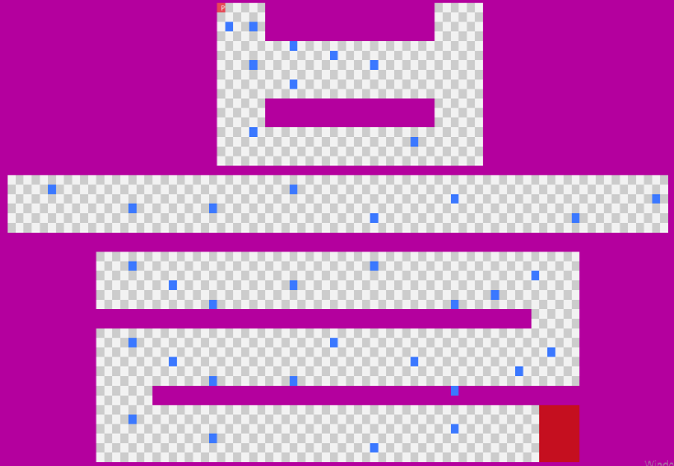
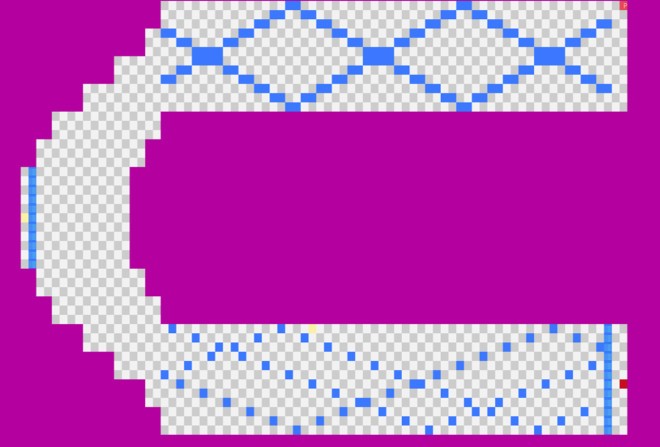
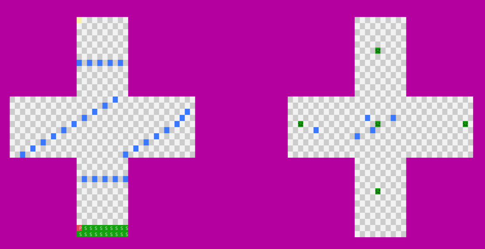

# The World's Hardest Get JOB

> C++ 콘솔 기반 취업 테마 퍼즐 게임 | 팀 프로젝트 (4인) — 부팀장 담당

---

## 개요

Windows 콘솔 환경에서 동작하는 2D 타일 기반 퍼즐 게임입니다.  
"취업"을 테마로 6개 스테이지를 클리어하며, 각 스테이지마다 이동 장애물·회전 장애물·추적형 체이서 등 다양한 위협 요소를 피해 출구에 도달해야 합니다.

- **개발 기간**: 2026년 03 ~ 04학기
- **개발 인원**: 4인 팀 프로젝트 (부팀장 담당)
- **개발 환경**: Visual Studio 2022, Windows 11, C++ (콘솔 / Win32 API)
- **담당 역할**: 맵 설계, 스테이지 5 개발, 엔딩·시작 화면 구현, 코드 통합

---

## 담당 구현 내용

### 1. MapManager 설계 및 맵 데이터 총괄

- 6개 스테이지를 `int[50][120]` 2D 배열로 구조화하고 타일 타입(`_W` 벽 / `_L` 길 / `_S` 시작 / `_E` 출구 / `_K1~5` 열쇠 / `_D1~5` 문) 체계 정의
- 플레이어 이동, 충돌 판정, 장애물 업데이트, 렌더링을 단일 `MapManager` 클래스로 통합 관리

```cpp
// MapManager.h 타일 타입 정의
enum TileType {
    _W = 0, _L = 1, _S = 2, _E = 3,
    _K1 = 4, _K2 = 5, _K3 = 6, _K4 = 7, _K5 = 8,
    _D1 = 9, _D2 = 10, _D3 = 11, _D4 = 12, _D5 = 13
};
```

### 2. 스테이지 5 맵 개발

- 회전형(`RotObs`) 및 추적형(`Chaser`) 장애물이 복합 배치된 최종 스테이지 맵 구현
- 열쇠·문 구조를 활용한 퍼즐 동선 설계

```cpp
// 회전 장애물 구조체
struct RotObs {
    float cx, cy;    // 회전 중심 좌표
    float radius;    // 회전 반지름
    float angle;     // 현재 각도
    float speed;     // 회전 속도
    int r, c;        // 현재 그리드 위치
};
```



### 3. 엔딩 및 시작 화면 구현

- 게임 클리어 시 "취업 성공" 엔딩 화면 및 총 사망 횟수 출력
- `GameSystem::GameState` (`GAME_CLEAR` / `RETURN_TO_MENU`)와 연동하여 화면 전환 처리
- 메인 메뉴: ASCII 아트 타이틀, 매트릭스 빗줄 이펙트, 명예의 전당(클리어 시간 랭킹), 조작법 안내 팝업 구현

```cpp
// GameSystem.h - 상태 기반 화면 전환
enum class GameState {
    PLAYING, PLAYER_DEAD, GAME_OVER,
    GAME_CLEAR,       // 최종 스테이지 출구 도달 → 엔딩
    RETURN_TO_MENU
};

void OnGameClear() { state = GameState::GAME_CLEAR; }
```

| 메인 메뉴 | 게임 클리어 | 게임 오버 |
|-----------|------------|----------|
|  |  |  |

### 4. 코드 통합

- 팀원별로 개발된 스테이지 맵·장애물 로직을 단일 프로젝트로 병합 및 충돌 해결
- `GameSystem` · `ScreenBuffer` · `MapManager` 간 의존 관계 정리 및 빌드 환경 통합

---

## 스테이지 구성

| 스테이지 | 특징 | 스크린샷 |
|---------|------|---------|
| Stage 1 | 워밍업 — 기본 이동 장애물 |  |
| Stage 2 | 이동 장애물 심화 |  |
| Stage 3 | 열쇠·문 퍼즐 |  |
| Stage 4 | 추적형 Chaser 등장 |  |
| Stage 5 | 회전(RotObs) + Chaser 복합 — **담당** |  |
| Stage 6 | 엔딩 스테이지 (취업 성공) | — |

---

## 프로젝트 구조

```
the_harder_game/
├── the_harder_game.sln
└── the_harder_game/
    ├── main.cpp                # 진입점 — 메인 루프·상태 전환
    ├── GameSystem.h            # 게임 상태(PLAYING/DEAD/CLEAR) + 사망 카운터
    ├── MapManager.cpp / .h     # 맵 로드·렌더링·충돌·장애물 업데이트 총괄
    ├── Types.h                 # 타일 타입·장애물 구조체 정의
    ├── Screenbuffer.cpp / .h   # 더블 버퍼링 기반 콘솔 렌더러
    ├── Render.cpp / .h         # 렌더링 유틸리티
    ├── Player.cpp / .h         # 플레이어 입력·이동
    ├── Mainmenu.cpp / .h       # 메인 메뉴 (타이틀·팝업·명예의 전당)
    ├── Success.cpp             # 엔딩 화면
    ├── Stage_1.cpp ~ Stage_5.cpp  # 스테이지별 맵 데이터
    └── rank.txt                # 클리어 시간 랭킹 저장
```

---

## 빌드 방법

1. `the_harder_game.sln`을 Visual Studio 2019 이상으로 열기
2. **빌드 → 솔루션 빌드** (Ctrl+Shift+B)
3. `x64/Debug/the_harder_game.exe` 실행

> **요구 사항**: Windows 10/11, Visual Studio 2019+, C++ 데스크톱 개발 워크로드
